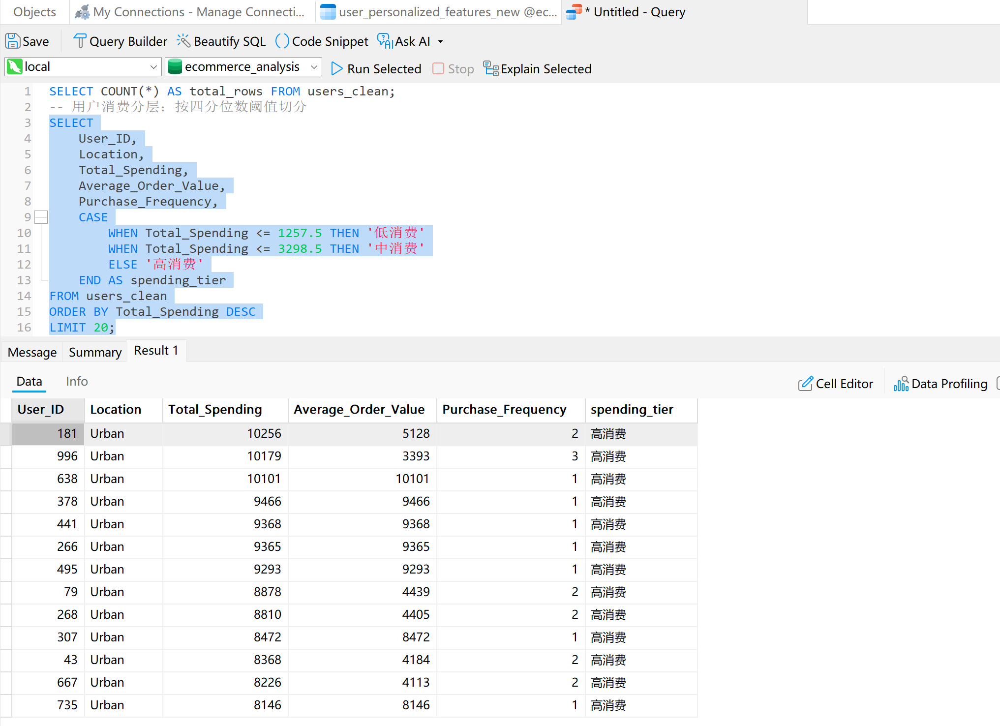
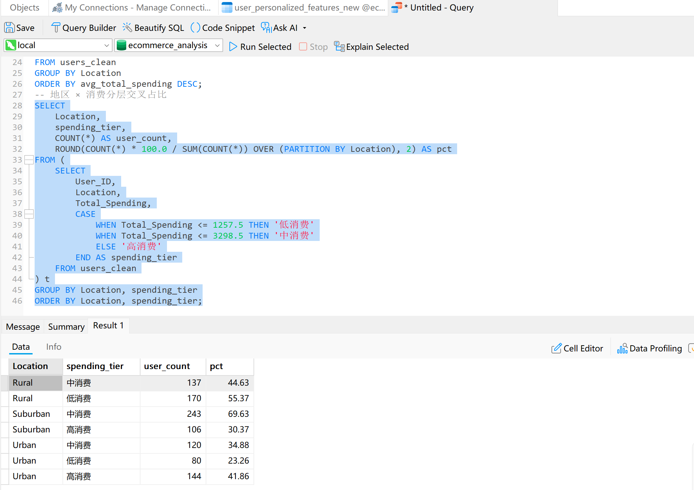
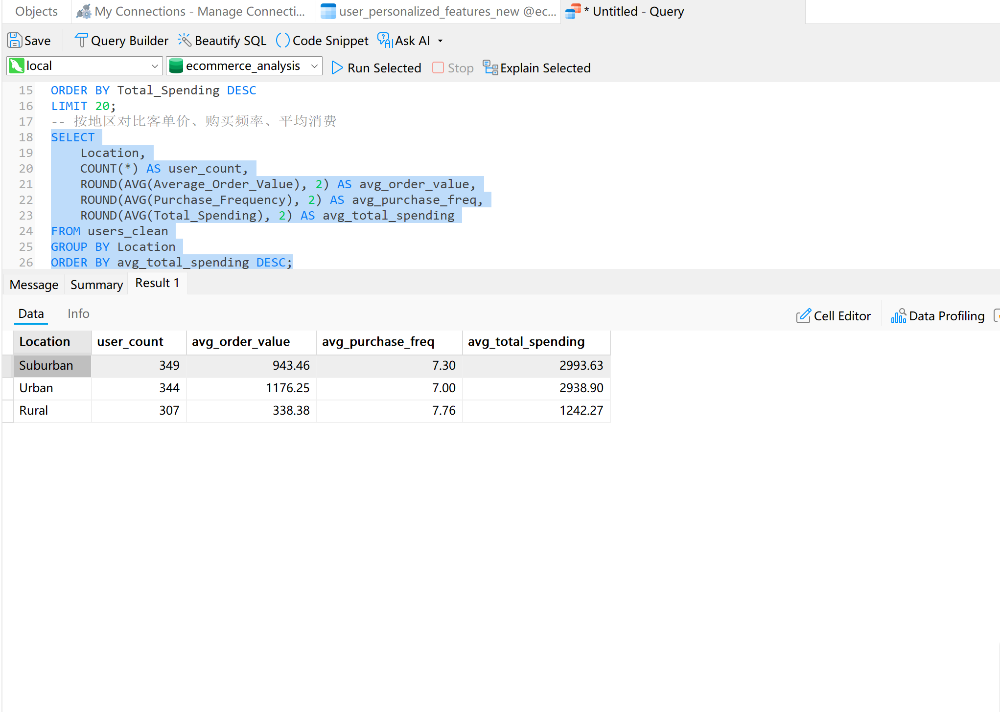

# 电商用户分层与消费行为分析

## 项目背景
基于抖音电商用户特征数据，分析不同地区用户的消费行为差异，
识别高价值用户群体，为差异化运营策略提供数据支持。

## 数据说明
- 数据来源：阿里云天池「抖音电商用户特征」数据集
- 样本量：1000 个用户
- 核心字段：User_ID, Location, Total_Spending, Average_Order_Value, Purchase_Frequency

## 分析方法
1. 使用四分位数将用户按 Total_Spending 切分为高/中/低消费三层
2. 按 Location 分组对比客单价、购买频率、平均消费
3. 交叉分析地区 × 消费分层，观察高价值用户分布

## 核心发现
- **农村用户是高频低客单群体**：购买频率最高（7.76 次），
  但客单价仅为城市用户的 29%（338 元 vs 1176 元），
  导致总消费最低，且无一人进入高消费层。
- **城市用户是低频高客单群体**：购买频率最低（7.00次），
  但客单价最高（1176 元），高消费用户占比 41.86%。
- **郊区用户介于两者之间**：客单价 943 元，高消费占比 30.37%。
- 
- 
- 

## 策略建议

- 对农村用户：通过凑单、满减、组合推荐提升客单价
- 对城市用户：通过复购召回、会员权益提升购买频率
- 对郊区用户：参考城市策略，重点提升高消费用户占比

## 文件说明
- `sql/user_segmentation.sql`：用户分层与地区对比的 SQL 脚本
- `data/raw/`：原始数据
- `data/processed/`：清洗后数据
- `visualizations/`：SQL 运行结果截图